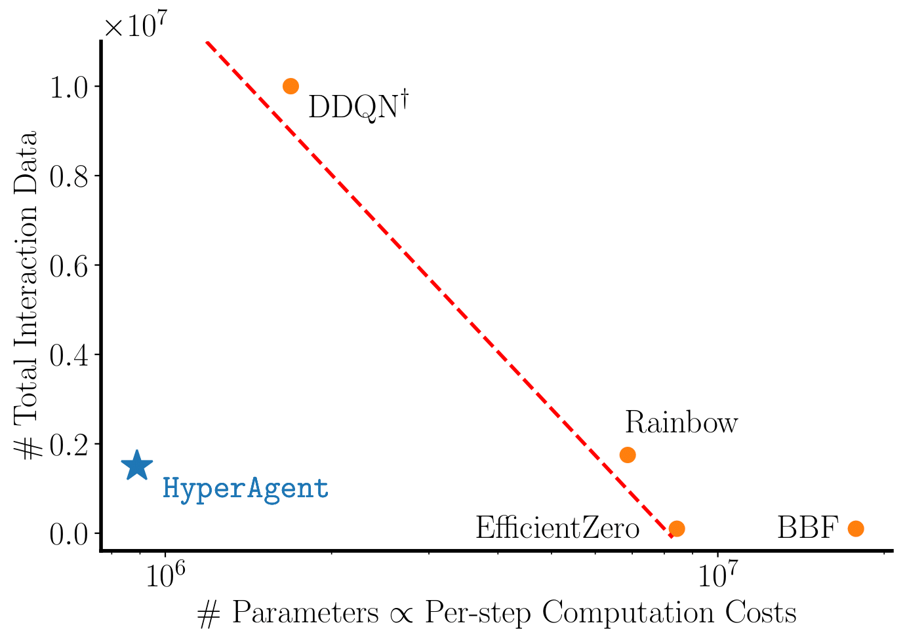

# HyperAgent [](https://hits.seeyoufarm.com)


This is the official implementation of **HyperAgent** algorithm, introduced in our **ICML** 2024 paper [Q-Star Meets Scalable Posterior Sampling: Bridging Theory and Practice via HyperAgent](https://arxiv.org/abs/2402.10228).



- ✅ **Data efficient**: **HyperAgent** uses only **15% data consumption** of Double-DQN (DDQN, 2016 STOA, **DeepMind**) to reach Human-Level Performance (1 IQM). (1.5M interactions.)
- ✅ **Computation efficient**: **HyperAgent** uses only **5% model parameters** of 2023 STOA algorithm ([BBF](https://paperswithcode.com/paper/bigger-better-faster-human-level-atari-with), **DeepMind**).
- Ensemble+ achieves a mere 0.22 IQM score under 1.5M interactions but necessitates double the parameters of HyperAgent.

Reference: [1] https://paperswithcode.com/sota/atari-games-100k-on-atari-100k
[2] [HyperAgent](https://arxiv.org/abs/2402.10228)
## Installation
```
cd HyperAgent
pip install -e .
```

## Usage
To reproduce the results of Atari (say Pong):
```
sh experiments/start_atari.sh Pong
```

To reproduce the results of DeepSea (say the size of 20):
```
sh experiments/start_deepsea.sh 20
```

## Citation

If you find this work useful to your research, please cite our paper.

```bibtex
@inproceedings{li2024hyperagent,
  title         = {{HyperAgent: A Simple, Scalable, Efficient and Provable Reinforcement Learning Framework for Complex Environments}},
  author        = {Li, Yingru and Xu, Jiawei and Han, Lei and Luo, Zhi-Quan},
  booktitle     = {Forty-first International Conference on Machine Learning},
  year          = {2024},
  series        = {Proceedings of Machine Learning Research},
  eprint        = {2402.10228},
  archiveprefix = {arXiv},
  primaryclass  = {cs.LG},
  url           = {https://arxiv.org/abs/2402.10228}
}
```
